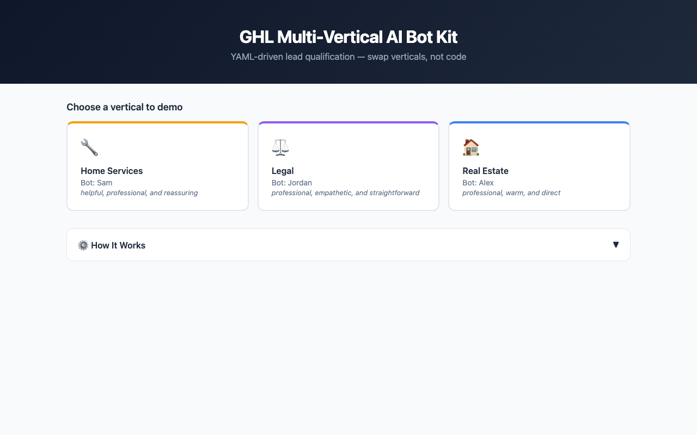
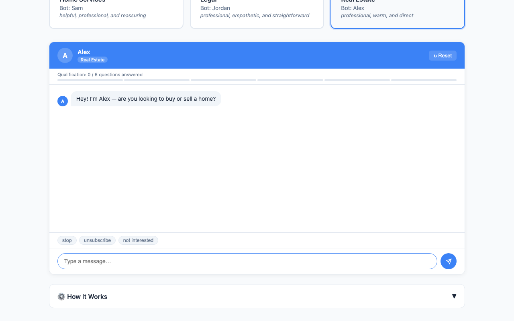
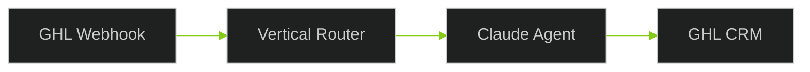

# GHL Multi-Vertical AI Bot Kit

A configurable GoHighLevel AI bot framework that supports any business vertical. Swap industries by changing a YAML config file -- real estate, home services, legal intake, or your own custom vertical. No code changes required. Built on FastAPI and Claude, with a GHL webhook handler that receives leads and replies via SMS automatically.

## Interactive Demo UI

Open `http://localhost:8000/demo/ui` after starting the server to get a browser-based chat interface:

- **Vertical selector** — 3 clickable cards (Real Estate, Home Services, Legal) with bot name and tone
- **Live chat panel** — SMS-style bubbles, qualification progress bar, typing indicator
- **Template trigger pills** — test "stop", "unsubscribe", "emergency" without typing
- **How It Works panel** — shows qualification questions, template triggers, and the rendered system prompt
- No GHL keys needed — only `ANTHROPIC_API_KEY`




## Quick Demo

Start the server and test immediately -- no GHL keys needed for the `/demo` endpoint:

```bash
# Install and run
pip install -r requirements.txt
cp .env.example .env
# Set ANTHROPIC_API_KEY in .env
uvicorn app.main:app --reload

# Try a real estate conversation
curl -X POST http://localhost:8000/demo \
  -H "Content-Type: application/json" \
  -d '{"vertical": "real_estate", "user_message": "I want to buy a house in the $400k range"}'

# Try home services
curl -X POST http://localhost:8000/demo \
  -H "Content-Type: application/json" \
  -d '{"vertical": "home_services", "user_message": "My AC stopped working"}'

# Try legal intake
curl -X POST http://localhost:8000/demo \
  -H "Content-Type: application/json" \
  -d '{"vertical": "legal", "user_message": "I need help with a custody matter"}'
```

## Features

- **3 verticals included** -- Real Estate (Alex), Home Services (Sam), Legal Intake (Jordan)
- **YAML-driven** -- add a new vertical in 5 minutes by writing a config file
- **`/demo` endpoint** -- test any vertical without GHL credentials
- **Claude-powered** -- intelligent conversations with qualification tracking
- **Template short-circuit** -- "stop", "unsubscribe", "emergency" responses skip Claude (saves API cost)
- **Qualification tracking** -- monitors which intake questions have been answered
- **Disqualification detection** -- politely exits when leads don't match criteria
- **GHL webhook** -- receives inbound messages, generates responses, replies via SMS
- **One-click deploy** -- `render.yaml` blueprint provisions everything on Render

## Architecture

```
                        +------------------+
                        |  verticals/*.yaml |
                        |  (YAML configs)   |
                        +--------+---------+
                                 |
                                 v
+----------+        +------------+------------+        +-------------+
|  GHL     | -----> |      ConfigLoader       | -----> |  BotEngine  |
|  Webhook |        | (loads + validates YAML) |        | (builds     |
+----------+        +-------------------------+        |  prompt,    |
                                                       |  tracks     |
+----------+        +-------------------------+        |  progress)  |
|  /demo   | -----> |      BotEngine          | <------+-------------+
|  endpoint|        | (vertical-agnostic)      |               |
+----------+        +-------------------------+               v
                                                       +-------------+
                                                       |  Claude API |
                                                       | (generates  |
                                                       |  response)  |
                                                       +------+------+
                                                              |
                                                              v
                                                       +-------------+
                                                       |  GHL Client |
                                                       | (sends SMS) |
                                                       +-------------+
```



## Verticals Comparison

| | Real Estate | Home Services | Legal Intake |
|---|---|---|---|
| **Bot Name** | Alex | Sam | Jordan |
| **Tone** | Professional, warm, direct | Helpful, reassuring | Professional, empathetic |
| **Questions** | 6 | 6 | 6 |
| **Booking** | Yes | Yes | Yes |
| **Key Safety** | No fabricated listings/prices | No DIY advice for gas/electrical | No legal advice, disclaimer on first contact |
| **Templates** | stop, unsubscribe, not interested | stop, unsubscribe, emergency, how much | stop, unsubscribe, emergency, how much |

## Setup

### Prerequisites

- Python 3.11+
- Anthropic API key ([console.anthropic.com](https://console.anthropic.com))
- GHL API key + Location ID (for webhook -- not needed for `/demo`)

### Local Development

```bash
# Clone and install
git clone <your-repo-url>
cd ghl-multi-vertical-kit
python -m venv .venv && source .venv/bin/activate
pip install -r requirements.txt

# Configure
cp .env.example .env
# Edit .env -- set at minimum: ANTHROPIC_API_KEY

# Start the API
uvicorn app.main:app --reload

# Verify
curl http://localhost:8000/health
```

### With Docker

```bash
cp .env.example .env
# Edit .env with your keys
docker-compose up
```

The API runs on `http://localhost:8000`.

### Run Tests

```bash
pytest tests/ -v
```

87 tests covering config loading, bot engine logic, qualification tracking, API endpoints, and YAML validation.

## Add a New Vertical in 5 Minutes

1. Create `verticals/your_vertical.yaml`:

```yaml
name: your_vertical

persona:
  name: BotName          # The bot's display name
  tone: friendly          # Personality descriptor injected into prompt
  greeting: "Hi! How can I help?"  # First message to new leads

qualification_questions:
  - "What service do you need?"
  - "What is your budget?"
  - "What is your timeline?"

disqualification_criteria:
  - "Budget below minimum threshold"
  - "Outside service area"

booking_enabled: true     # Whether to offer appointment booking

system_prompt: |
  You are {bot_name}. Tone: {tone}.
  Ask these questions one at a time:
  {questions}
  Disqualify if:
  {disqualification}
  Keep responses under 160 chars. Do NOT reveal you are AI.

response_templates:       # Exact-match responses that skip Claude
  stop: "No problem, stopping!"
  unsubscribe: "Removed. Take care!"
```

2. Set the vertical in `.env`:

```
ACTIVE_VERTICAL=your_vertical
```

3. Restart the server. Done.

**Template variables** expanded at runtime:
- `{bot_name}` -- `persona.name`
- `{tone}` -- `persona.tone`
- `{questions}` -- numbered list from `qualification_questions`
- `{disqualification}` -- bullet list from `disqualification_criteria`

## API Reference

### `GET /health`

Returns service status, active vertical, and GHL configuration state.

```json
{"status": "healthy", "vertical": "real_estate", "ghl_configured": true, "environment": "development"}
```

### `GET /verticals`

Returns list of available vertical names (from `verticals/*.yaml`).

```json
["home_services", "legal", "real_estate"]
```

### `GET /demo/ui`

Serves the interactive HTML demo page. Open in a browser — no auth required.

### `GET /demo/config/{vertical}`

Returns the full config and rendered system prompt for a vertical. Useful for inspecting how YAML templates expand at runtime.

```json
{
  "name": "real_estate",
  "bot_name": "Alex",
  "tone": "professional, warm, and direct",
  "greeting": "Hey! I'm Alex — are you looking to buy or sell a home?",
  "qualification_questions": ["Are you looking to buy or sell?", "..."],
  "disqualification_criteria": ["Budget is under $50,000", "..."],
  "booking_enabled": true,
  "response_templates": {"stop": "No problem — I'll stop messaging you. Best of luck!"},
  "system_prompt_rendered": "You are Alex, a direct and friendly real estate assistant..."
}
```

### `POST /demo`

Simulate a bot conversation without GHL. Only requires `ANTHROPIC_API_KEY`.

**Request:**
```json
{
  "vertical": "real_estate",
  "user_message": "I want to buy a house",
  "conversation_history": [],
  "contact_info": {"name": "Jane", "email": "jane@example.com"}
}
```

**Response:**
```json
{
  "vertical": "real_estate",
  "bot_name": "Alex",
  "response": "Hey Jane! Great to hear you're looking to buy. What area are you interested in?",
  "qualification_progress": {"total": 6, "answered": 1, "remaining": 5, "complete": false},
  "model": "claude-sonnet-4-5-20250514"
}
```

### `POST /api/ghl/webhook`

GHL webhook endpoint. Receives inbound messages, generates a bot response, and replies via GHL SMS.

**Request** (from GHL):
```json
{
  "contactId": "abc123",
  "body": "I need help with my AC",
  "fullName": "John Smith",
  "phone": "+15551234567"
}
```

**Response:**
```json
{"status": "processed", "contact_id": "abc123", "response_sent": true, "vertical": "home_services"}
```

## Deploy to Render

1. Push this repo to GitHub
2. Go to [dashboard.render.com](https://dashboard.render.com) > **New** > **Blueprint**
3. Connect your GitHub repo -- `render.yaml` provisions the service automatically
4. Set these env vars in the Render dashboard:
   - `ANTHROPIC_API_KEY` -- your Anthropic key
   - `GHL_API_KEY` -- your GoHighLevel API key
   - `GHL_LOCATION_ID` -- your GHL location ID
5. `ADMIN_API_KEY` is auto-generated. `ACTIVE_VERTICAL` defaults to `real_estate`.

The service includes a `/health` check path for Render's health monitoring.

## Environment Variables

| Variable | Required | Default | Description |
|----------|----------|---------|-------------|
| `ANTHROPIC_API_KEY` | Yes | -- | Anthropic API key |
| `GHL_API_KEY` | For webhook | -- | GoHighLevel API key |
| `GHL_LOCATION_ID` | For webhook | -- | GHL Location ID |
| `ADMIN_API_KEY` | No | `dev-admin-key` | Protects admin endpoints |
| `ACTIVE_VERTICAL` | No | `real_estate` | Active vertical (matches filename in `verticals/`) |
| `GHL_CALENDAR_ID` | No | -- | GHL calendar ID for booking |
| `GHL_WEBHOOK_SECRET` | No | -- | HMAC secret for webhook signature verification |
| `CLAUDE_MODEL` | No | `claude-sonnet-4-5-20250514` | Claude model override |
| `REDIS_URL` | No | -- | Redis connection URL. Falls back to in-memory store if unset |
| `ENVIRONMENT` | No | `development` | `development` or `production` |
| `LOG_LEVEL` | No | `INFO` | Logging level |

## Project Structure

```
ghl-multi-vertical-kit/
├── app/
│   ├── main.py              # FastAPI entry point
│   ├── config.py             # Pydantic settings (reads from .env)
│   ├── models.py             # Request/response schemas + VerticalConfig
│   ├── routes/
│   │   ├── webhook.py        # GHL webhook handler
│   │   └── demo.py           # /demo + /demo/ui + /demo/config + /verticals endpoints
│   ├── services/
│   │   ├── bot_engine.py     # Core bot logic (prompt building, qualification, Claude)
│   │   ├── ghl_client.py     # GHL API client (contacts, messaging, calendar)
│   │   └── config_loader.py  # YAML loader + validator + cache
│   └── static/
│       └── demo.html         # Self-contained browser demo UI
├── verticals/
│   ├── real_estate.yaml      # Buyer/seller qualification
│   ├── home_services.yaml    # HVAC/plumbing/electrical intake
│   └── legal.yaml            # Client intake with disclaimer
├── docs/screenshots/         # Demo UI screenshots
├── tests/                    # 105 tests
├── .env.example
├── docker-compose.yml
├── render.yaml
├── requirements.txt
└── README.md
```
